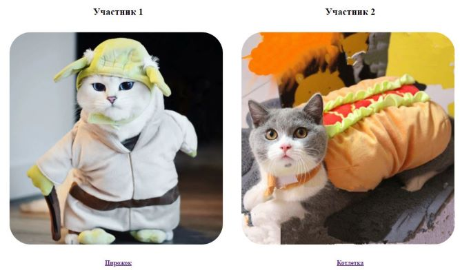
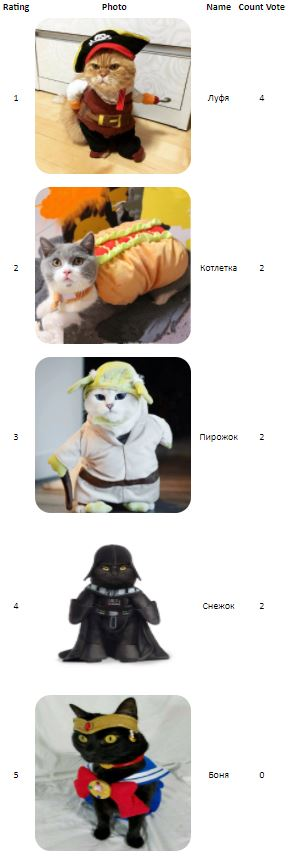

# Choose cats application

Spring boot web application.
Database H2.
Thymeleaf.
HTML, CSS, JS.

Страница с голосованием выглядит так:

Страница с топом котиков:

- Пары для голосования перебираются по принципу "каждый с каждым", пока не закончатся все варианты;
- Пользователь не видит повторения пар;
- Пары подбираются случайно для каждого пользователя;
- В приложении 7 котиков;
- Проголосовать можно, кликнув по имени или по фотографии;
- Когда заканчиваются пары, будет показан топ котиков;
- Топ формируется из суммы голосов всех пользователей;
- Приложение многопользовательское;
- У всех котов есть имя